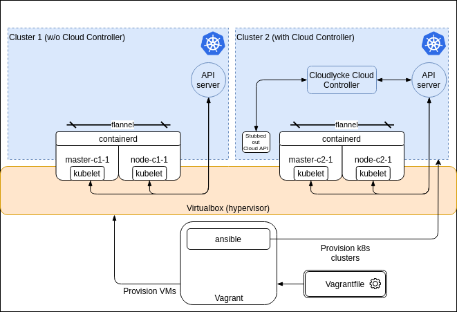

# The Cloudlycke Kubernetes Cloud Controller

This repository contains the Cloudlycke `cloud-controller`, an [out-of-tree](https://kubernetes.io/blog/2019/04/17/the-future-of-cloud-providers-in-kubernetes/) and [by-the-book](https://kubernetes.io/docs/tasks/administer-cluster/developing-cloud-controller-manager/#out-of-tree) built Kubernetes cloud controller that implements the `cloud-provider` [Interface](https://github.com/kubernetes/cloud-provider/blob/v0.18.2/cloud.go#L43-L62).

This `cloud-controller` is built using the `v1.18.x` release of Kubernetes. This means that `v1.18.x` is used everywhere we have dependencies on Kubernetes. 

Cloudlycke is my fake cloud provider, which at the moment is Vagrant. I wanted my Kubernetes clusters in this cloud provider to be able to integrate with the underlying cloud. For the purpose of showing the ins and outs of the Kubernetes `cloud-controller` most of the API "calls" to Cloudlycke is hardcoded to respond with a particular response.

I've written an in-depth [write-up](**ADD LINK HERE**) that explains and explores the Cloud Controller.

Inspired by the DigitalOcean and OpenStack Cloud Controllers!

## Components
* `Vagrant`
* `VirtualBox`
* `ansible`

## Detailed overview



## Starting the Vagrant and deploying Kubernetes

## Running the Cloud Controller
* `export KUBECONFIG=<PATH TO admin-master-c2-1.conf>`
* Check the cluster nodes
```
kubectl get nodes

NAME          STATUS   ROLES    AGE   VERSION
master-c2-1   Ready    master   24m   v1.18.2
node-c2-1     Ready    <none>   19m   v1.18.2
```
* Deploy nginx pods (deployment with 3 replicas) for demo purposes
``` 
kubectl run --image nginx --replicas 3 nginx-demo
```
* Check the status of all pods across all namespaces
```
kubectl get pods -A
NAMESPACE     NAME                                  READY   STATUS    RESTARTS   AGE   IP              NODE          NOMINATED NODE   READINESS GATES
default       nginx-demo-5756474c97-m4b9t           0/1     Pending   0          25m   <none>          <none>        <none>           <none>
default       nginx-demo-5756474c97-qqjg4           0/1     Pending   0          25m   <none>          <none>        <none>           <none>
default       nginx-demo-5756474c97-rbhvt           0/1     Pending   0          25m   <none>          <none>        <none>           <none>
kube-system   coredns-66bff467f8-cthqz              0/1     Pending   0          32m   <none>          <none>        <none>           <none>
kube-system   coredns-66bff467f8-j24c2              0/1     Pending   0          32m   <none>          <none>        <none>           <none>
kube-system   etcd-master-c2-1                      1/1     Running   0          32m   192.168.20.10   master-c2-1   <none>           <none>
kube-system   kube-apiserver-master-c2-1            1/1     Running   0          32m   192.168.20.10   master-c2-1   <none>           <none>
kube-system   kube-controller-manager-master-c2-1   1/1     Running   0          32m   192.168.20.10   master-c2-1   <none>           <none>
kube-system   kube-flannel-ds-amd64-qhbdp           1/1     Running   0          32m   192.168.20.10   master-c2-1   <none>           <none>
kube-system   kube-flannel-ds-amd64-r22f7           1/1     Running   1          27m   192.168.20.11   node-c2-1     <none>           <none>
kube-system   kube-proxy-bqn2b                      1/1     Running   0          32m   192.168.20.10   master-c2-1   <none>           <none>
kube-system   kube-proxy-rmwx7                      1/1     Running   0          27m   192.168.20.11   node-c2-1     <none>           <none>
kube-system   kube-scheduler-master-c2-1            1/1     Running   0          32m   192.168.20.10   master-c2-1   <none>           <none>
```
Note that some of the pods are reporting status `Pending`. The ones that are running are primarily the `DaemonSet` created ones and the ones with toleration configured that allows them to be scheduled e.g. `node-role.kubernetes.io/master: ""`.

* `kubectl describe pods nginx-demo-5756474c97-m4b9t`
```
Events:
  Type     Reason            Age                From               Message
  ----     ------            ----               ----               -------
  Warning  FailedScheduling  20s (x2 over 20s)  default-scheduler  0/2 nodes are available: 1 node(s) had taint {node-role.kubernetes.io/master: }, that the pod didn't tolerate, 1 node(s) had taint {node.cloudprovider.kubernetes.io/uninitialized: true}, that the pod didn't tolerate.
``` 
Note that the master node `master-c2-1` will be tainted and only allow pods with the correct toleration. The worker node `node-c2-1` is still awaiting initialization of our external cloud provider controller.

### References

